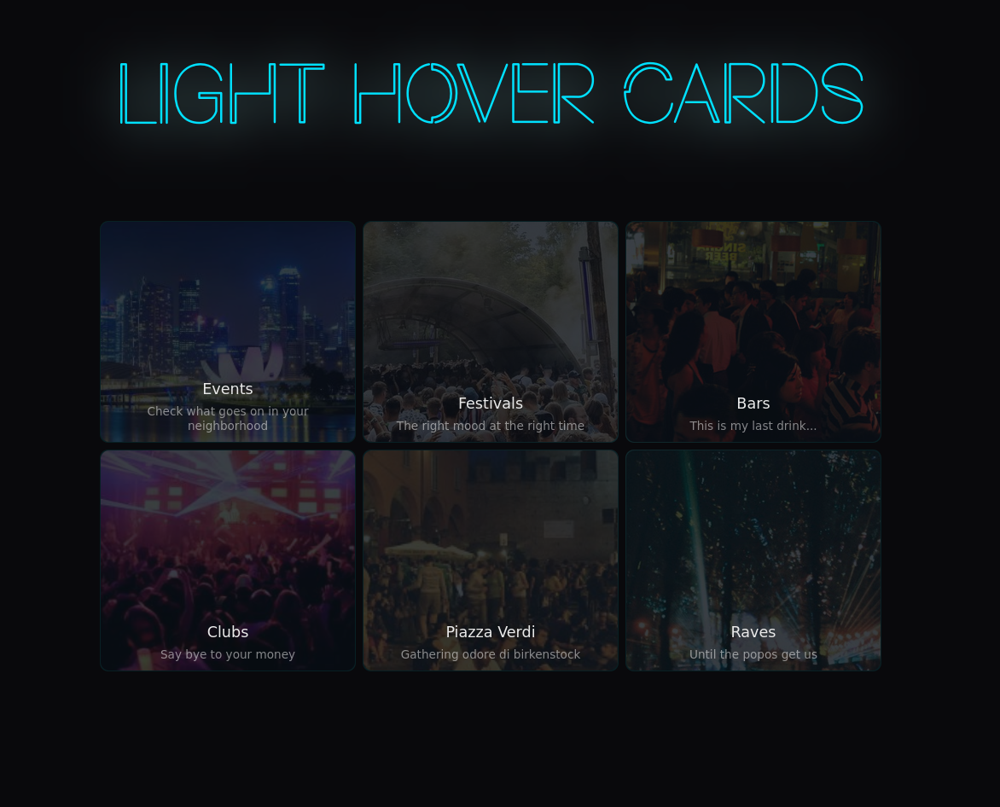

## light-card-hover

# This is a concept Vue component

I started this project to practice some `Vue.js`, since most of the things I've been doing were made with React. 


## How to run it?
Go into the main directory of this project:
```
cd light-hover/
```

After that, serve the site with npm

```
npm run serve
```

Check [http://localhost:8080/](http://localhost:8080/)


### Preview



### Is this component demo hosted?

I hosted a demo on Netlify, **[click here to see it](https://light-hover-cards.netlify.app/)**
